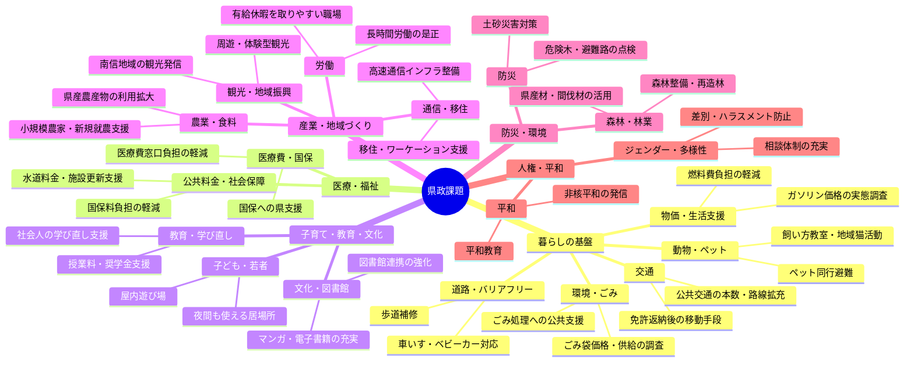
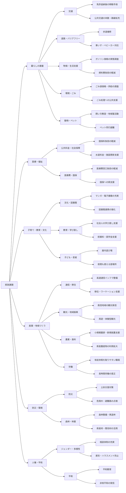
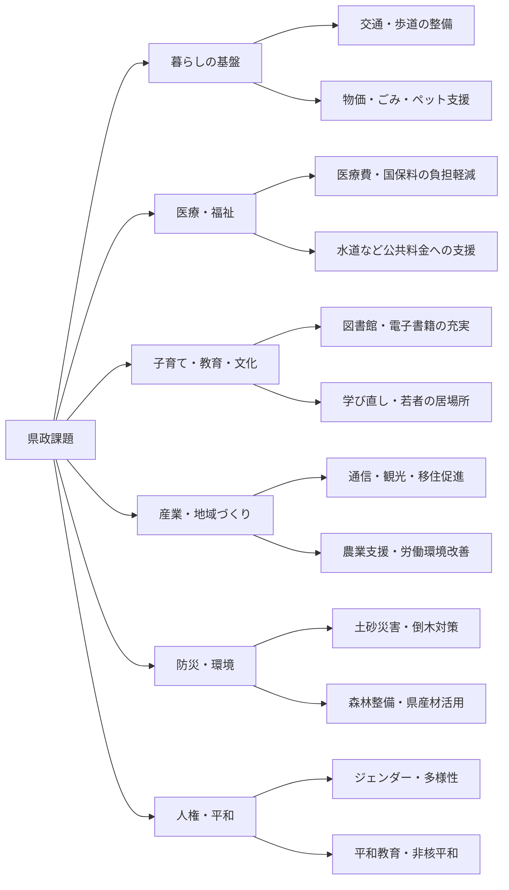

# 2027県議選へ向けた 聴きあうリアルトークセッション アイデア集約

- AIを活用したアイデアの集約です。

## アイデアリスト

- 各回で出てきたアイデアの中から、県政で何かできそうなアイデアを列挙します。

| 実施回 | 要求・困りごと                                                                                         | 大カテゴリー       | 小カテゴリー       | 県政でできること                                                                                                                                                                               |
| ------ | ------------------------------------------------------------------------------------------------------ | ------------------ | ------------------ | ---------------------------------------------------------------------------------------------------------------------------------------------------------------------------------------------- |
| 第1回  | 免許返納後も移動できる交通手段がほしい。公共交通の本数・路線を増やしてほしい。                         | 暮らしの基盤       | 交通               | 県の地域公共交通計画に、乗合タクシー・デマンド交通・コミュニティバスの拡充を位置づける。免許返納者への運賃補助、交通空白地域への県補助、広域路線の維持支援を強める。                           |
| 第1回  | 歩道がガタガタしていて、車いす・ベビーカーで通りにくい。歩道を広げてほしい。                           | 暮らしの基盤       | 道路・バリアフリー | 県管理道路の歩道補修・バリアフリー化を進める。市町村道も含め、通学路・病院周辺・公共施設周辺の危険箇所調査と改修補助を行う。                                                                   |
| 第1回  | 長野県のガソリン価格が高く、カルテル問題も不安。                                                       | 暮らしの基盤       | 物価・生活支援     | 県として価格実態を継続調査し、公正取引委員会・国への調査要請を行う。生活必需の移動費負担を軽くするため、公共交通支援や低所得世帯・事業者への燃料費補助を検討する。                             |
| 第1回  | 高速ネット回線が未対応で、通信環境をよくしてほしい。                                                   | 産業・地域づくり   | 通信・移住         | 山間地・南信地域も含めた高速通信インフラ整備を県の移住・産業政策に位置づけ、通信事業者への整備要請、補助制度、公共施設での高速回線・Wi-Fi整備を進める。                                        |
| 第1回  | 飯田市・南信にもっと人が来てほしい。観光でも南信に注目してほしい。                                     | 産業・地域づくり   | 観光・地域振興     | 県の観光振興で南信地域を重点的に発信する。公共交通と観光地をつなぐ周遊支援、体験型観光、移住・ワーケーション施策と通信インフラ整備を組み合わせる。                                             |
| 第1回  | ジェンダー的に生きやすい地域にしてほしい。                                                             | 人権・平和         | ジェンダー・多様性 | 県の男女共同参画・多様性施策を強め、学校・職場・行政窓口での相談体制、啓発、差別やハラスメント防止の取り組みを進める。                                                                         |
| 第1回  | 子や孫が明るく暮らせるようにしたい。核兵器のない世界、世界平和を求めたい。                             | 人権・平和         | 平和               | 県として平和行政を推進し、平和教育、被爆・戦争体験の継承、非核平和に関する国への意見書・要望、自治体間連携を進める。                                                                           |
| 第1回  | ゴミ袋が高い・小さい・手に入りにくい。ゴミ処理を公共サービスとして支えてほしい。                       | 暮らしの基盤       | 環境・ごみ         | 市町村任せにせず、県としてごみ袋価格・供給状況の実態調査を行う。ごみ処理広域化、リサイクル支援、指定袋への県補助、災害・原材料不足時の供給対策を検討する。                                     |
| 第1回  | 国保料・水道料金が上がり、自治体だけでは対応しきれない。                                               | 医療・福祉         | 公共料金・社会保障 | 国保料引き下げに向けた県独自の財政支援、子どもの均等割軽減、低所得世帯への支援を強める。水道施設更新への県補助、広域連携、国への財政支援要請を行う。                                           |
| 第1回  | 医療費を窓口無料化してほしい。国民健康保険料が高すぎる。                                               | 医療・福祉         | 医療費・国保       | 子ども・障がい者・高齢者などの医療費窓口負担軽減を県制度として拡充する。国保への県繰り入れや市町村支援を強め、国へ国庫負担増を求める。                                                         |
| 第1回  | 図書館にマンガを増やしてほしい。電子図書館の蔵書を増やしてほしい。                                     | 子育て・教育・文化 | 文化・図書館       | 県立図書館と市町村図書館の連携で、マンガ・電子書籍・学習資料など多様な蔵書を拡充する。電子図書館の共同調達や利用しやすいシステム整備を支援する。                                               |
| 第1回  | 食料自給率を高めたい。農業を支援してほしい。                                                           | 産業・地域づくり   | 農業・食料         | 小規模農家・新規就農者への支援、学校給食での県産農産物利用、農地保全、価格保障・所得補償の国への要望を進める。地域内で食料を生産・消費できる仕組みを強める。                                   |
| 第1回  | 大学に行き直したい。学び直しの機会がほしい。                                                           | 子育て・教育・文化 | 教育・学び直し     | 県内大学・短大・専門学校・職業訓練校と連携し、社会人の学び直し支援、授業料補助、奨学金返済支援、オンライン講座の拡充を行う。                                                                   |
| 第1回  | 全天候型で24時間使える遊び場・居場所がほしい。                                                         | 子育て・教育・文化 | 子ども・若者       | 子ども・若者・家族が使える屋内遊び場、スポーツ・文化施設、夜間も利用できる居場所づくりを市町村と連携して支援する。既存公共施設の開放や広域利用も進める。                                       |
| 第1回  | 土砂崩れ・倒木など、災害時が心配。                                                                     | 防災・環境         | 防災               | 土砂災害警戒区域の点検、危険木の伐採、避難路・河川・砂防施設の整備を進める。地域防災計画に高齢者・障がい者・ペット同行避難など具体的な避難支援を盛り込む。                                     |
| 第1回  | 山の木を切って活用し、植え替えも進めてほしい。                                                         | 防災・環境         | 森林・林業         | 森林整備、間伐材活用、県産材利用、再造林への補助を強める。災害防止、林業雇用、木質バイオマス利用を結びつけた地域循環型の森林政策を進める。                                                     |
| 第1回  | ペットの飼い方教室、猫のフリーゾーン、動物の共済制度、犬の保育園・介護施設、災害時のペット避難が必要。 | 暮らしの基盤       | 動物・ペット       | 動物愛護センター・保健所・市町村と連携し、飼い方教室、譲渡・地域猫活動、ペット同行避難所の整備を進める。高齢者とペットの生活支援、民間施設整備への支援、動物医療費負担軽減の仕組みを研究する。 |
| 第1回  | 有給休暇を入社直後から取りやすくしてほしい。長時間労働をなくし、短時間労働でも暮らせるようにしたい。   | 産業・地域づくり   | 労働               | 県内企業への労働環境改善支援、入札・補助金での労働条件評価、相談窓口の強化を行う。国へ有給休暇制度・労働時間規制の改善を求め、県として短時間正社員やワークシェアの普及を支援する。             |

## グラフ化

### マインドマップ形式

### 県政課題の一覧化

### 県政課題の簡略版

